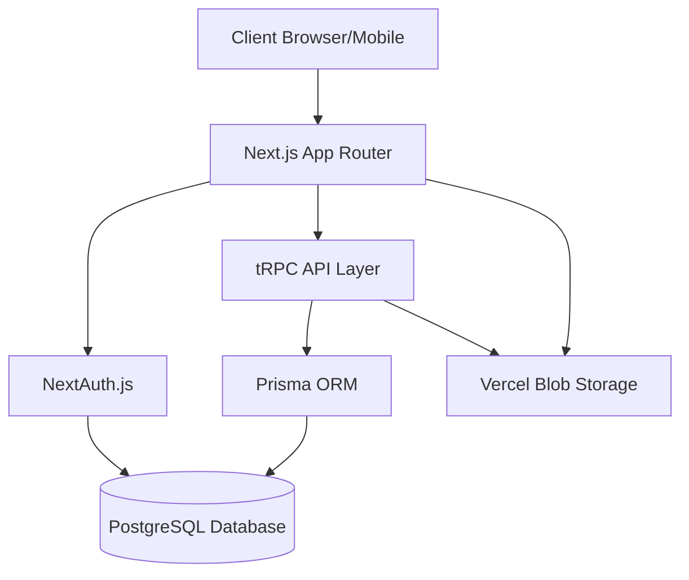
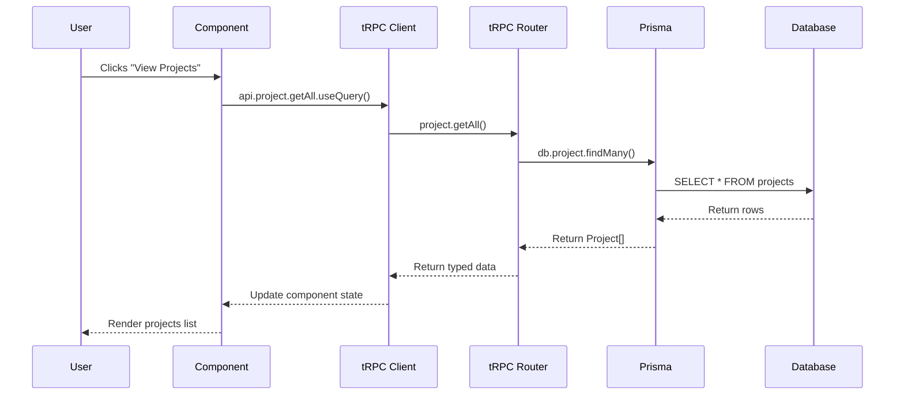
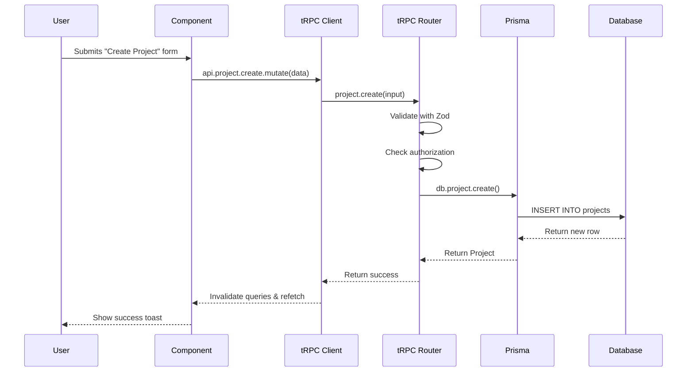
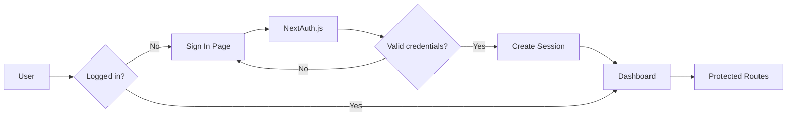
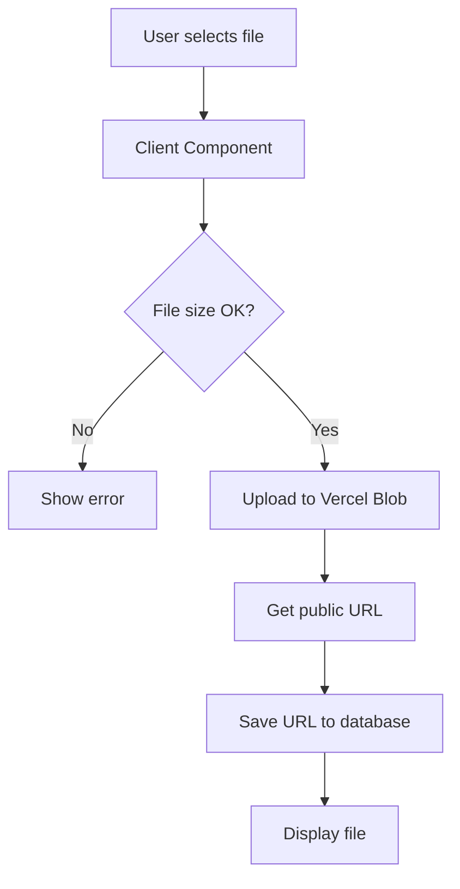
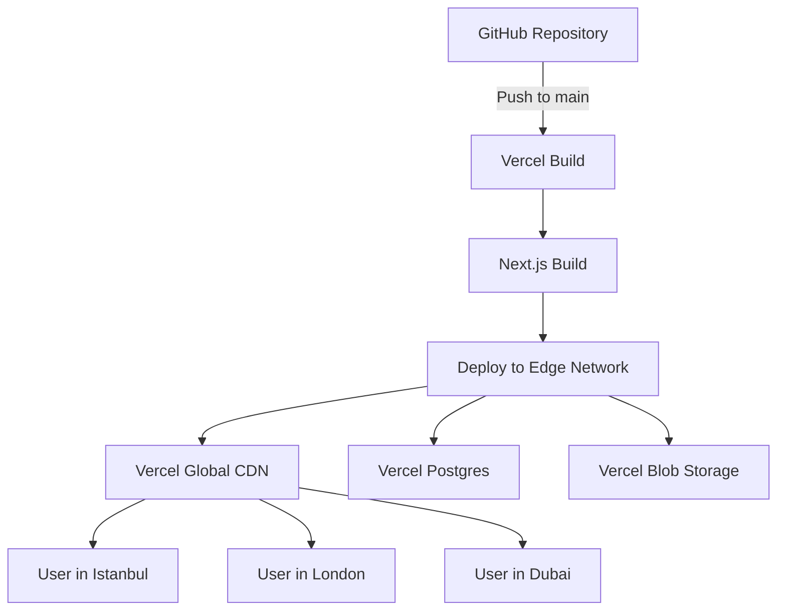

## Sistem Mimarisi

Saha Kontrol Uygulaması, modern full-stack web mimarisi prensipleriyle tasarlanmıştır. Monorepo yaklaşımı ile frontend ve backend aynı Next.js projesi içinde yer alır.



---

## Teknoloji Yığını

### Frontend Stack

<CardGroup cols={2}>
  <Card title="Next.js 14" icon="react">
    **App Router** ile modern React framework
    - Server Components
    - Client Components
    - Server Actions
    - Streaming SSR
  </Card>

  <Card title="TypeScript" icon="ts">
    End-to-end **type safety**
    - Compile-time errors
    - IntelliSense support
    - Refactoring safety
    - Self-documenting code
  </Card>

  <Card title="Tailwind CSS" icon="paintbrush">
    Utility-first **CSS framework**
    - Responsive design
    - Dark mode support
    - Custom design system
    - Performance optimized
  </Card>

  <Card title="shadcn/ui" icon="palette">
    **Accessible** component library
    - Radix UI primitives
    - Customizable
    - Copy-paste components
    - No package bloat
  </Card>
</CardGroup>

### Backend Stack

<CardGroup cols={2}>
  <Card title="tRPC" icon="bolt">
    **Type-safe** API without code generation
    - End-to-end typesafety
    - No API contracts
    - Auto-completion
    - Runtime validation
  </Card>

  <Card title="Prisma" icon="database">
    Next-generation **ORM**
    - Type-safe queries
    - Auto-completion
    - Migrations
    - Prisma Studio
  </Card>

  <Card title="PostgreSQL" icon="elephant">
    Powerful **relational database**
    - ACID compliance
    - Complex queries
    - Full-text search
    - JSON support
  </Card>

  <Card title="NextAuth.js" icon="shield-halved">
    **Authentication** for Next.js
    - Multiple providers
    - Session management
    - CSRF protection
    - Role-based access
  </Card>
</CardGroup>

---

## Katmanlı Mimari

### 1. Presentation Layer (UI)

```
src/app/
├── (auth)/              # Authentication pages
├── (dashboard)/         # Protected pages
│   ├── projects/
│   ├── inspections/
│   ├── defects/
│   └── reports/
└── api/                 # API routes
```

**Sorumluluklar:**
- Kullanıcı arayüzü render
- Form validasyonu (client-side)
- Kullanıcı etkileşimleri
- State management (React Query)

### 2. API Layer (tRPC)

```typescript
src/server/api/routers/
├── project.ts           # Project operations
├── document.ts          # Document management
├── inspection.ts        # Inspection CRUD
├── defect.ts           # Defect/NCR management
└── report.ts           # Report generation
```

**Sorumluluklar:**
- Request validation (Zod schemas)
- Business logic
- Authorization checks
- Data transformation

### 3. Data Access Layer (Prisma)

```typescript
src/server/db.ts         # Prisma client
prisma/schema.prisma     # Database schema
```

**Sorumluluklar:**
- Database queries
- Transactions
- Relations
- Data migrations

### 4. Database Layer (PostgreSQL)

**Sorumluluklar:**
- Data persistence
- Data integrity
- Indexing
- Backups

---

## Veri Akışı

### Okuma İşlemi (Query)



### Yazma İşlemi (Mutation)



---

## Authentication Flow



### Session Management

```typescript
// src/server/auth.ts
export const authOptions: NextAuthOptions = {
  providers: [
    CredentialsProvider({
      // Email/password authentication
    }),
    GitHubProvider({
      // GitHub OAuth (optional)
    }),
  ],
  callbacks: {
    session: ({ session, token }) => ({
      ...session,
      user: {
        ...session.user,
        id: token.sub,
        role: token.role, // Add custom fields
      },
    }),
  },
};
```

### Authorization

```typescript
// Middleware'de rol kontrolü
export const protectedProcedure = t.procedure
  .use(async ({ ctx, next }) => {
    if (!ctx.session?.user) {
      throw new TRPCError({ code: "UNAUTHORIZED" });
    }
    return next({
      ctx: {
        session: ctx.session,
      },
    });
  });

// Specific role check
export const adminProcedure = protectedProcedure
  .use(async ({ ctx, next }) => {
    if (ctx.session.user.role !== "SUPER_ADMIN") {
      throw new TRPCError({ code: "FORBIDDEN" });
    }
    return next();
  });
```

---

## File Upload Architecture



### Upload Implementation

```typescript
// Using Uploadthing
import { createUploadthing } from "uploadthing/next";

const f = createUploadthing();

export const uploadRouter = {
  documentUploader: f({
    pdf: { maxFileSize: "10MB" },
    image: { maxFileSize: "5MB" },
  })
    .middleware(async ({ req }) => {
      const user = await getServerSession(req);
      if (!user) throw new Error("Unauthorized");
      return { userId: user.id };
    })
    .onUploadComplete(async ({ metadata, file }) => {
      console.log("Upload complete for userId:", metadata.userId);
      console.log("File URL:", file.url);

      // Save to database
      await db.document.create({
        data: {
          fileUrl: file.url,
          uploadedById: metadata.userId,
          // ...
        },
      });
    }),
};
```

---

## Caching Strategy

### React Query (TanStack Query)

```typescript
// Automatic caching and revalidation
const { data, isLoading } = api.project.getAll.useQuery(
  { status: "IN_PROGRESS" },
  {
    staleTime: 5 * 60 * 1000, // 5 minutes
    cacheTime: 10 * 60 * 1000, // 10 minutes
    refetchOnWindowFocus: true,
  }
);

// Optimistic updates
const mutation = api.project.update.useMutation({
  onMutate: async (newData) => {
    // Cancel outgoing queries
    await utils.project.getById.cancel();

    // Snapshot previous value
    const previous = utils.project.getById.getData();

    // Optimistically update
    utils.project.getById.setData(newData.id, newData);

    return { previous };
  },
  onError: (err, newData, context) => {
    // Rollback on error
    utils.project.getById.setData(newData.id, context.previous);
  },
  onSettled: () => {
    // Refetch after success or error
    utils.project.getById.invalidate();
  },
});
```

### Database Indexes

```prisma
model Project {
  id     String @id @default(cuid())
  code   String @unique  // Automatically indexed
  status ProjectStatus

  @@index([status])      // Index for filtering
  @@index([createdAt])   // Index for sorting
}

model Inspection {
  id        String @id @default(cuid())
  projectId String
  type      InspectionType

  @@index([projectId, type])  // Composite index
}
```

---

## Performance Optimizations

### 1. Server Components (Default)

```tsx
// app/projects/page.tsx
// This is a Server Component by default
async function ProjectsPage() {
  const projects = await db.project.findMany();

  return <ProjectsList projects={projects} />;
}
```

**Benefits:**
- Zero JavaScript bundle
- Direct database access
- SEO friendly
- Fast initial load

### 2. Client Components (When Needed)

```tsx
'use client';

// Only for interactive components
export function ProjectForm() {
  const [name, setName] = useState('');
  // ...
}
```

### 3. Code Splitting

```tsx
// Lazy load heavy components
const ReportChart = dynamic(
  () => import('@/components/reports/ReportChart'),
  {
    loading: () => <Skeleton />,
    ssr: false, // Disable server-side rendering if needed
  }
);
```

### 4. Image Optimization

```tsx
import Image from 'next/image';

<Image
  src={defect.photoUrl}
  alt="Defect photo"
  width={400}
  height={300}
  loading="lazy"
  placeholder="blur"
/>
```

---

## Security Measures

<AccordionGroup>
  <Accordion title="Input Validation" icon="shield-check">
    **Zod schemas** her input için:

    ```typescript
    const createProjectSchema = z.object({
      name: z.string().min(3).max(100),
      code: z.string().regex(/^PRJ-\d{3}$/),
      client: z.string().min(2),
      startDate: z.date(),
    });
    ```
  </Accordion>

  <Accordion title="SQL Injection Prevention" icon="database">
    **Prisma ORM** kullanımı ile otomatik koruma:

    ```typescript
    // ✅ Safe - Parameterized query
    await db.project.findMany({
      where: { name: userInput }
    });

    // ❌ Never use raw SQL with user input
    ```
  </Accordion>

  <Accordion title="XSS Prevention" icon="code">
    **React automatic escaping** ve **Content Security Policy**:

    ```typescript
    // next.config.js
    headers: [
      {
        key: 'Content-Security-Policy',
        value: "default-src 'self'; script-src 'self' 'unsafe-inline';"
      }
    ]
    ```
  </Accordion>

  <Accordion title="CSRF Protection" icon="shield-exclamation">
    **NextAuth.js** built-in CSRF tokens:

    ```typescript
    // Automatic CSRF protection for all POST requests
    export default NextAuth(authOptions);
    ```
  </Accordion>

  <Accordion title="Rate Limiting" icon="gauge-high">
    **API rate limiting** to prevent abuse:

    ```typescript
    import rateLimit from '@/lib/rate-limit';

    export const limiter = rateLimit({
      interval: 60 * 1000, // 1 minute
      uniqueTokenPerInterval: 500,
    });
    ```
  </Accordion>
</AccordionGroup>

---

## Deployment Architecture



### CI/CD Pipeline

1. **Push to GitHub** → Triggers Vercel build
2. **Run Tests** → Unit + Integration tests
3. **Build** → Next.js production build
4. **Deploy** → Edge network (global)
5. **Health Check** → Automated smoke tests
6. **Rollback** → If health check fails

### Environment Variables

```bash
# Production (Vercel Dashboard)
DATABASE_URL="postgresql://prod..."
NEXTAUTH_URL="https://saha-kontrol.com"
UPLOADTHING_SECRET="prod-secret"

# Preview (PR environments)
DATABASE_URL="postgresql://preview..."
NEXTAUTH_URL="https://preview-123.vercel.app"

# Development (Local)
DATABASE_URL="postgresql://localhost..."
NEXTAUTH_URL="http://localhost:3000"
```

---

## Monitoring and Logging

### Application Monitoring

```typescript
// Using Vercel Analytics
import { Analytics } from '@vercel/analytics/react';

export default function RootLayout({ children }) {
  return (
    <html>
      <body>
        {children}
        <Analytics />
      </body>
    </html>
  );
}
```

### Error Tracking

```typescript
// Sentry integration (optional)
import * as Sentry from "@sentry/nextjs";

Sentry.init({
  dsn: process.env.SENTRY_DSN,
  environment: process.env.NODE_ENV,
  tracesSampleRate: 1.0,
});
```

### Performance Monitoring

- **Web Vitals** tracking (LCP, FID, CLS)
- **API response times** via tRPC middleware
- **Database query performance** via Prisma logging
- **User session recording** (optional)

---

## Scalability Considerations

<CardGroup cols={2}>
  <Card title="Horizontal Scaling" icon="arrows-left-right">
    Vercel otomatik olarak ölçeklenir
    - Serverless functions
    - Edge network
    - CDN caching
  </Card>

  <Card title="Database Scaling" icon="database">
    PostgreSQL connection pooling
    - PgBouncer
    - Read replicas
    - Partitioning
  </Card>

  <Card title="File Storage" icon="hard-drive">
    Blob storage auto-scales
    - CDN distribution
    - Lazy loading
    - Image optimization
  </Card>

  <Card title="Caching Strategy" icon="layer-group">
    Multi-level caching
    - React Query (client)
    - Redis (server, optional)
    - CDN (edge)
  </Card>
</CardGroup>

---

## İleri Okuma

<CardGroup cols={2}>
  <Card title="Next.js Docs" icon="react" href="https://nextjs.org/docs">
    Official Next.js documentation
  </Card>

  <Card title="tRPC Docs" icon="bolt" href="https://trpc.io/docs">
    Learn about type-safe APIs
  </Card>

  <Card title="Prisma Docs" icon="database" href="https://www.prisma.io/docs">
    Database ORM guide
  </Card>

  <Card title="Vercel Platform" icon="cloud" href="https://vercel.com/docs">
    Deployment and hosting
  </Card>
</CardGroup>
