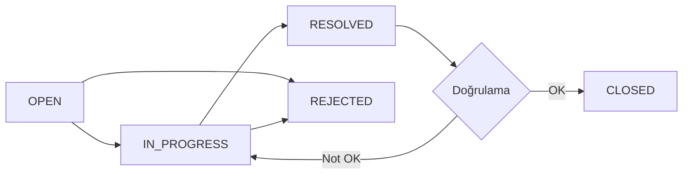

## NCR Nedir?

**NCR (Non-Conformance Report)** veya **Uygunsuzluk Raporu**, projedeki standartlara, spesifikasyonlara veya kalite gereksinimlerine uymayan durumların kayıt altına alınması ve düzeltilmesi sürecidir.

## Uygunsuzluk Özellikleri

```typescript
interface Defect {
  id: string;
  projectId: string;
  code: string;                      // "NCR-2025-001"
  reportedById: string;
  reportedBy: User;
  assignedToId?: string;
  assignedTo?: User;
  title: string;                     // "Beton sınıfı uygunsuz"
  description: string;               // Detaylı açıklama
  location: string;                  // "Blok A - 3. Kat"
  severity: Severity;                // CRITICAL | HIGH | MEDIUM | LOW
  status: DefectStatus;              // OPEN | IN_PROGRESS | RESOLVED | CLOSED | REJECTED
  category: string;                  // "Beton", "Donatı", "MEP"
  photosBefore: string[];            // Uygunsuzluk fotoğrafları
  photosAfter: string[];             // Düzeltme fotoğrafları
  rootCause?: string;                // Kök neden analizi
  correctiveAction?: string;         // Düzeltici aksiyon
  preventiveAction?: string;         // Önleyici aksiyon
  dueDate?: Date;                    // Hedef tamamlama tarihi
  closedAt?: Date;                   // Kapanış tarihi
  verifiedBy?: string;               // Doğrulayan kişi
  relatedInspectionId?: string;      // İlişkili kontrol listesi
  createdAt: Date;
  updatedAt: Date;
}
```

---

## Önem Dereceleri (Severity)

<Tabs>
  <Tab title="Kritik">
    <Card title="CRITICAL" icon="skull-crossbones" color="#dc2626">
      **Acil müdahale gerektirir!**

      **Özellikler:**
      - Yapısal güvenliği etkiler
      - Can güvenliği riski
      - Yasal yaptırım riski
      - Hemen durdurulmalı

      **Örnekler:**
      - Yetersiz donatı çapı
      - Kritik statik eleman hatası
      - Yangın güvenlik sistemi eksikliği
      - Çökme riski
    </Card>
  </Tab>

  <Tab title="Yüksek">
    <Card title="HIGH" icon="triangle-exclamation" color="#ea580c">
      **24 saat içinde aksiyon!**

      **Özellikler:**
      - Yapı kalitesini ciddi etkiler
      - Fonksiyonel sorunlara yol açar
      - Düzeltilmezse kritik olur
      - Öncelikli müdahale

      **Örnekler:**
      - Beton sınıfı uygunsuzluğu
      - Yalıtım eksikliği
      - MEP tesisat hataları
      - Kalıp ölçü hataları
    </Card>
  </Tab>

  <Tab title="Orta">
    <Card title="MEDIUM" icon="exclamation" color="#f59e0b">
      **1 hafta içinde düzeltilmeli**

      **Özellikler:**
      - Estetik veya küçük fonksiyonel sorunlar
      - İleriki aşamalarda sorun yaratabilir
      - Planlı düzeltme yeterli

      **Örnekler:**
      - Sıva pürüzleri
      - Küçük beton yüzey hataları
      - Boyut tolerans aşımları (küçük)
      - Bitirme kalitesi sorunları
    </Card>
  </Tab>

  <Tab title="Düşük">
    <Card title="LOW" icon="info" color="#3b82f6">
      **Fırsat bulundukça düzeltilebilir**

      **Özellikler:**
      - Kozmetik sorunlar
      - Kullanımı etkilemez
      - Opsiyonel düzeltme
      - Kayıt amaçlı

      **Örnekler:**
      - Küçük çizikler
      - Renk uyumsuzlukları
      - Temizlik eksiklikleri
      - Dokümantasyon hataları
    </Card>
  </Tab>
</Tabs>

---

## Durum Akışı



### Durum Açıklamaları

<CardGroup cols={2}>
  <Card title="OPEN" icon="folder-open" color="#dc2626">
    Yeni açılmış, henüz atanmamış
  </Card>

  <Card title="IN_PROGRESS" icon="spinner" color="#f59e0b">
    Çözüm için çalışılıyor
  </Card>

  <Card title="RESOLVED" icon="check" color="#3b82f6">
    Düzeltme tamamlandı, doğrulama bekliyor
  </Card>

  <Card title="CLOSED" icon="circle-check" color="#16a34a">
    Doğrulandı ve kapatıldı
  </Card>

  <Card title="REJECTED" icon="circle-xmark" color="#6b7280">
    Geçersiz veya tekrar
  </Card>
</CardGroup>

---

## NCR Oluşturma

### Adım Adım Süreç

<Steps>
  <Step title="Temel Bilgiler">
    NCR başlığı ve kategorisi girin.

    ```typescript
    title: "Beton dayanımı yetersiz - 3. Kat kolon C4"
    category: "Beton"
    location: "Blok A - 3. Kat - Kolon C4"
    ```
  </Step>

  <Step title="Detaylı Açıklama">
    Uygunsuzluğu detaylı açıklayın.

    ```typescript
    description: `
    28 günlük küp numunesi basınç testi sonucu:
    - Beklenen: 25 N/mm² (C25)
    - Ölçülen: 18 N/mm²
    - Sapma: -28%

    İlgili doküman: TEST-RAPOR-2025-042
    Test tarihi: 15.01.2025
    Test laboratuvarı: ABC Test Lab
    `
    ```
  </Step>

  <Step title="Önem Derecesi Seçimi">
    Uygunsuzluğun ciddiyetini belirleyin.

    ```typescript
    severity: "HIGH"  // Yapısal eleman olduğu için HIGH
    ```

    <Warning>
      Önem derecesi doğru seçilmelidir. Yapısal uygunsuzluklar HIGH veya CRITICAL olmalıdır.
    </Warning>
  </Step>

  <Step title="Fotoğraf Ekleme">
    Uygunsuzluğu gösteren fotoğraflar ekleyin.

    ```typescript
    photosBefore: [
      "https://.../kolon-c4-genel.jpg",
      "https://.../kolon-c4-detay.jpg",
      "https://.../test-numunesi.jpg"
    ]
    ```
  </Step>

  <Step title="Sorumlu Atama">
    Düzeltmeden sorumlu kişiyi atayın.

    ```typescript
    assignedToId: "user_site_engineer_123"
    dueDate: new Date("2025-02-01")  // 2 hafta süre
    ```

    <Info>
      Sorumlu kişiye otomatik bildirim gönderilir.
    </Info>
  </Step>

  <Step title="İlgili Kaynaklar">
    İlgili kontrol listesi veya dokümanları bağlayın.

    ```typescript
    relatedInspectionId: "insp_123abc"
    relatedDocuments: ["doc_456def", "doc_789ghi"]
    ```
  </Step>
</Steps>

### API Kullanımı

```typescript
const { data: ncr } = await api.defect.create.mutate({
  projectId: "clx123",
  title: "Beton dayanımı yetersiz",
  description: "Detaylı açıklama...",
  location: "Blok A - 3. Kat - Kolon C4",
  severity: "HIGH",
  category: "Beton",
  assignedToId: "user_123",
  dueDate: new Date("2025-02-01"),
  photosBefore: [...],
});

// NCR kodu otomatik oluşturulur: NCR-2025-001
```

---

## Düzeltici Aksiyon Süreci

### 1. Kök Neden Analizi

```typescript
// 5 Why Analizi
rootCauseAnalysis: `
Neden 1: Beton dayanımı düşük çıktı
  Neden 2: Neden? → Su/çimento oranı yüksek
    Neden 3: Neden? → Şantiyede su ilave edilmiş
      Neden 4: Neden? → İşçi bilgi eksikliği
        Neden 5: Neden? → Eğitim verilmemiş

KÖK NEDEN: İşçi eğitimi eksikliği
`
```

### 2. Düzeltici Aksiyon

```typescript
correctiveAction: `
1. Kolon C4 yıkılıp yeniden yapılacak
2. Yıkım: 20.01.2025
3. Yeni dökü: 25.01.2025
4. Test: 22.02.2025 (28 gün sonra)

Sorumlu: Ahmet Yılmaz (Saha Şefi)
Maliyet: ~15.000 TL
Süre: 5 gün
`
```

### 3. Önleyici Aksiyon

```typescript
preventiveAction: `
1. Tüm işçilere beton dökümü eğitimi verilecek
2. "Su ilavesi yasaktır" uyarı tabelaları asılacak
3. Beton pompa operatörü eğitimi
4. Şantiye girişinde bilgilendirme
5. Haftalık toolbox meeting'de hatırlatma

Sorumlu: QA/QC Manager
Tamamlanma: 31.01.2025
`
```

---

## Durum Güncelleme

### Çalışmaya Başlama

```typescript
await api.defect.updateStatus.mutate({
  id: ncr.id,
  status: "IN_PROGRESS",
  note: "Yıkım için hazırlıklar başladı. Tahmini başlangıç: 20.01.2025",
});

// Bildirim gönderilir: Rapor eden kişi + QA/QC Manager
```

### Çözüldü Olarak İşaretleme

```typescript
await api.defect.resolve.mutate({
  id: ncr.id,
  correctiveAction: "Kolon yıkılıp yeniden yapıldı",
  rootCause: "İşçi eğitimi eksikliği",
  preventiveAction: "Tüm ekibe eğitim verildi",
  photosAfter: [
    "https://.../kolon-c4-yeni-1.jpg",
    "https://.../kolon-c4-yeni-2.jpg",
    "https://.../test-numunesi-yeni.jpg",
  ],
});

// Status: IN_PROGRESS → RESOLVED
```

### Doğrulama ve Kapama

```typescript
// QA/QC Manager doğrular
await api.defect.verify.mutate({
  id: ncr.id,
  approved: true,
  notes: "Yeni test sonucu 28 N/mm². Kabul edilir. Kapatılıyor.",
});

// Status: RESOLVED → CLOSED
// closedAt: new Date()
```

### Reddetme (Geçersiz NCR)

```typescript
await api.defect.reject.mutate({
  id: ncr.id,
  reason: "Duplicate - NCR-2025-002 ile aynı. Bu kapatılıyor.",
});

// Status: OPEN → REJECTED
```

---

## Fotoğraf Karşılaştırma

### Önce/Sonra Görünümü

```tsx
function BeforeAfterComparison({
  before,
  after
}: {
  before: string[];
  after: string[]
}) {
  return (
    <div className="grid grid-cols-2 gap-4">
      <div>
        <h3>Önce</h3>
        <ImageGallery images={before} />
      </div>
      <div>
        <h3>Sonra</h3>
        <ImageGallery images={after} />
      </div>
    </div>
  );
}
```

### Slider Karşılaştırma

```tsx
import ReactCompareImage from 'react-compare-image';

function ImageComparison({ before, after }: { before: string; after: string }) {
  return (
    <ReactCompareImage
      leftImage={before}
      rightImage={after}
      sliderLineColor="#16a34a"
    />
  );
}
```

---

## Bildirimler

### Otomatik Bildirim Akışı

<Steps>
  <Step title="NCR Oluşturuldu">
    **Bildirim alır:**
    - Atanan kişi
    - QA/QC Manager
    - Proje yöneticisi (HIGH/CRITICAL ise)
  </Step>

  <Step title="Durum Değişti">
    **Bildirim alır:**
    - Rapor eden kişi
    - QA/QC Manager
  </Step>

  <Step title="Süre Aşımına Yakın">
    **Bildirim alır (3 gün kala):**
    - Atanan kişi
    - QA/QC Manager
  </Step>

  <Step title="Süre Aşıldı">
    **Bildirim alır:**
    - Atanan kişi
    - QA/QC Manager
    - Proje yöneticisi
  </Step>
</Steps>

### Email Bildirimi

```typescript
import { sendEmail } from '@/lib/email';

async function notifyDefectAssigned(defect: Defect) {
  await sendEmail({
    to: defect.assignedTo.email,
    subject: `[NCR-${defect.code}] Yeni uygunsuzluk atandı`,
    template: 'defect-assigned',
    data: {
      defectCode: defect.code,
      title: defect.title,
      severity: defect.severity,
      dueDate: defect.dueDate,
      link: `${APP_URL}/defects/${defect.id}`,
    },
  });
}
```

---

## İstatistikler ve Metrikler

### Dashboard Metrikleri

```typescript
const { data: stats } = api.defect.getStats.useQuery({
  projectId: "clx123",
});

// Örnek sonuç:
{
  total: 45,
  open: 12,
  inProgress: 18,
  resolved: 8,
  closed: 7,
  bySeverity: {
    critical: 2,
    high: 15,
    medium: 20,
    low: 8,
  },
  byCategory: {
    "Beton": 18,
    "Donatı": 12,
    "MEP": 8,
    "Diğer": 7,
  },
  avgResolutionTime: 5.2,  // gün
  overdueCount: 3,
}
```

### Grafikler

```tsx
import { BarChart, Bar, XAxis, YAxis, Tooltip } from 'recharts';

function DefectChart({ stats }: { stats: DefectStats }) {
  const data = [
    { name: 'Kritik', value: stats.bySeverity.critical },
    { name: 'Yüksek', value: stats.bySeverity.high },
    { name: 'Orta', value: stats.bySeverity.medium },
    { name: 'Düşük', value: stats.bySeverity.low },
  ];

  return (
    <BarChart width={600} height={300} data={data}>
      <XAxis dataKey="name" />
      <YAxis />
      <Tooltip />
      <Bar dataKey="value" fill="#16a34a" />
    </BarChart>
  );
}
```

---

## Best Practices

<AccordionGroup>
  <Accordion title="Hızlı Raporlama" icon="bolt">
    - Uygunsuzluğu tespit eder etmez kaydedin
    - Fotoğrafları hemen çekin (sonra unutulur)
    - Detaylı açıklama yazın (gelecekte unutulur)
    - İlgili dokümanları bağlayın
  </Accordion>

  <Accordion title="Doğru Önem Derecesi" icon="gauge">
    **Sorular:**
    - Can güvenliği riski var mı? → CRITICAL
    - Yapısal güvenlik etkileniyor mu? → HIGH
    - Fonksiyon bozuluyor mu? → MEDIUM
    - Sadece görsel sorun mu? → LOW
  </Accordion>

  <Accordion title="Kök Neden Analizi" icon="magnifying-glass">
    **5 Why tekniği kullanın:**
    - Sorunu yüzeysel değil, köklü çözün
    - Aynı hata tekrarlanmasın
    - Sistem iyileştirme fırsatı
  </Accordion>

  <Accordion title="Fotoğraf Standartları" icon="camera">
    **Önce fotoğrafları:**
    - Genel görünüm
    - Detay çekim
    - Ölçü referansı (cetvel, metre)

    **Sonra fotoğrafları:**
    - Aynı açıdan çekin
    - Karşılaştırma yapılabilir olsun
  </Accordion>

  <Accordion title="Takip ve Kontrol" icon="list-check">
    - Günlük NCR listesi gözden geçirin
    - Süresi yaklaşan NCR'leri önceliklendirin
    - Haftalık NCR review meeting yapın
    - Trend analizi yapın
  </Accordion>
</AccordionGroup>

---

## Entegrasyonlar

### Kontrol Listesi → NCR

```typescript
// Kontrol listesinde FAIL olan maddeler için otomatik NCR öneri
if (checkItem.result === 'FAIL') {
  await api.defect.createFromInspection.mutate({
    inspectionId: inspection.id,
    checkItemId: checkItem.id,
    severity: "HIGH",  // Otomatik önerilir
  });
}
```

### NCR → Rapor

```typescript
// Aylık NCR özet raporu
const report = await api.report.generateNCRSummary.mutate({
  projectId: "clx123",
  period: "2025-01",
});

// Excel export
exportToExcel(report);
```

---

## İleri Okuma

<CardGroup cols={2}>
  <Card title="Kontrol Listeleri" icon="clipboard-check" href="/concepts/inspections">
    Kontrol listelerinden NCR oluşturma
  </Card>

  <Card title="Raporlama" icon="chart-line" href="/concepts/reports">
    NCR istatistikleri ve raporları
  </Card>
</CardGroup>
