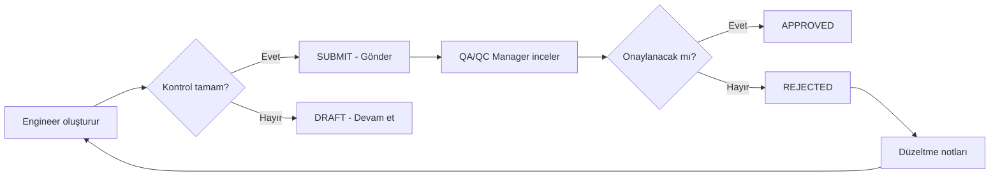

## Kontrol Listesi Nedir?

**Inspection (Kontrol Listesi)**, sahada yapılan kalite kontrol aktivitelerinin dijital kaydıdır. Geleneksel kağıt formların yerini alarak, fotoğraflı dokümantasyon, GPS lokasyon ve dijital imza ile kapsamlı kayıt sağlar.

## Kontrol Türleri

<CardGroup cols={2}>
  <Card title="Beton Dökümü" icon="trowel-bricks">
    **CONCRETE_POURING**
    - Kalıp kontrolü
    - Donatı kontrolü
    - Beton numune alma
    - Dökü prosedürü
    - Kür kontrolü
  </Card>

  <Card title="Demir Donatı" icon="bars">
    **REBAR_INSPECTION**
    - Çap kontrolü
    - Aralık kontrolü
    - Kaplama kontrolü
    - Ek ve bindirme
    - Ankraj uzunluğu
  </Card>

  <Card title="Kalıp Kontrolü" icon="cube">
    **FORMWORK_CHECK**
    - Ölçü kontrolü
    - Kot kontrolü
    - Sızdırmazlık
    - Destek kontrolü
    - Temizlik
  </Card>

  <Card title="Zemin Hazırlığı" icon="mountain">
    **SOIL_PREPARATION**
    - Kazı kontrolü
    - Dolgu kontrolü
    - Kompaksiyon testi
    - Zemin iyileştirme
    - Drenaj sistemi
  </Card>

  <Card title="MEP Tesisatları" icon="plug">
    **MEP_INSTALLATION**
    - Elektrik tesisatı
    - Mekanik tesisat
    - Sıhhi tesisat
    - HVAC sistemleri
    - Yangın sistemleri
  </Card>

  <Card title="Dış Cephe" icon="building">
    **FACADE_INSPECTION**
    - Kaplama kontrolü
    - Yalıtım kontrolü
    - Sızdırmazlık testi
    - İskele güvenliği
    - Bitirme kalitesi
  </Card>

  <Card title="Su Yalıtımı" icon="droplet">
    **WATERPROOFING**
    - Malzeme kontrolü
    - Uygulama prosedürü
    - Kat kalınlığı
    - Detay çözümleri
    - Su testi
  </Card>

  <Card title="Bitirme İşleri" icon="paintbrush">
    **FINISHING_WORKS**
    - Sıva kontrolü
    - Boya kontrolü
    - Fayans/seramik
    - Parke/laminat
    - Son temizlik
  </Card>
</CardGroup>

---

## Veri Yapısı

```typescript
interface Inspection {
  id: string;
  projectId: string;
  inspectorId: string;
  inspector: User;
  type: InspectionType;
  location: string;                    // "Blok A - 3. Kat"
  gpsLat?: number;                     // 37.0123
  gpsLng?: number;                     // 27.4567
  status: InspectionStatus;            // DRAFT | SUBMITTED | APPROVED | REJECTED
  checkItems: CheckItem[];             // Kontrol maddeleri
  photos: string[];                    // Fotoğraf URL'leri
  notes?: string;                      // Genel notlar
  signature?: string;                  // Dijital imza URL
  inspectedAt: Date;                   // Kontrol tarihi
  approvedBy?: string;
  approvedAt?: Date;
  rejectionReason?: string;
  createdAt: Date;
  updatedAt: Date;
}

interface CheckItem {
  id: string;
  label: string;                       // "Beton sıcaklığı < 32°C"
  result: 'PASS' | 'FAIL' | 'NA';     // ✅ ❌ ⊘
  notes?: string;                      // Özel notlar
  photos?: string[];                   // Madde bazlı fotoğraflar
  measuredValue?: string;              // "28°C" (opsiyonel)
}

enum InspectionStatus {
  DRAFT         // Taslak - henüz gönderilmemiş
  SUBMITTED     // Gönderildi - onay bekliyor
  APPROVED      // Onaylandı
  REJECTED      // Reddedildi
}
```

---

## Kontrol Listesi Oluşturma

### Adım Adım Süreç

<Steps>
  <Step title="Kontrol Tipi Seçimi">
    Yapılacak kontrolün türünü seçin.

    ```tsx
    <InspectionTypeSelector
      value={selectedType}
      onChange={setSelectedType}
    />

    // CONCRETE_POURING seçildi
    ```
  </Step>

  <Step title="Lokasyon ve GPS">
    Kontrol yapılacak konumu belirtin.

    ```typescript
    location: "Blok A - 3. Kat - Aks B-C/3-4"

    // GPS otomatik yakalanır (opsiyonel)
    const position = await navigator.geolocation.getCurrentPosition();
    gpsLat: position.coords.latitude;
    gpsLng: position.coords.longitude;
    ```

    <Tip>
      GPS verisi, kontrol yerinin harita üzerinde gösterilmesini sağlar.
    </Tip>
  </Step>

  <Step title="Kontrol Maddelerini İşaretle">
    Her madde için sonuç seçin: ✅ PASS | ❌ FAIL | ⊘ NA

    ```tsx
    <ChecklistGrid>
      {checklistTemplate.map(item => (
        <ChecklistItem
          key={item.id}
          label={item.label}
          result={item.result}
          onResultChange={(result) => updateItem(item.id, result)}
          onPhotoAdd={(photo) => addPhoto(item.id, photo)}
          onNoteAdd={(note) => addNote(item.id, note)}
        />
      ))}
    </ChecklistGrid>
    ```

    Örnek kontrol maddeleri (Beton Dökümü):

    | Kontrol Maddesi | Sonuç | Not |
    |-----------------|-------|-----|
    | Kalıp temizliği yapıldı mı? | ✅ | - |
    | Donatı kontrolü OK? | ✅ | - |
    | Beton sıcaklığı < 32°C? | ✅ | 28°C ölçüldü |
    | Slump değeri 12±2 cm? | ❌ | 15 cm - Sınır dışı |
    | Vibrasyon düzgün yapıldı mı? | ✅ | Fotoğraf eklendi |
  </Step>

  <Step title="Fotoğraf Ekleme">
    Her madde için fotoğraf ekleyin.

    ```tsx
    <PhotoUpload
      maxPhotos={5}
      onUpload={(photos) => addPhotosToItem(item.id, photos)}
    />

    // Fotoğraflar otomatik compress ve upload edilir
    ```

    <Warning>
      Kritik maddeler (özellikle FAIL sonuçları) için fotoğraf **zorunlu**dur.
    </Warning>
  </Step>

  <Step title="Genel Notlar ve İmza">
    Genel notlar ekleyin ve dijital imza atın.

    ```tsx
    <TextField
      label="Genel Notlar"
      multiline
      rows={4}
      value={notes}
      onChange={(e) => setNotes(e.target.value)}
    />

    <SignaturePad
      onSave={(signatureDataUrl) => setSignature(signatureDataUrl)}
    />
    ```
  </Step>

  <Step title="Gönder ve Onay">
    Kontrolü gönderin. QA/QC Manager onaylayacak.

    ```typescript
    await api.inspection.submit.mutate({
      id: inspection.id,
      signature: signatureDataUrl,
    });

    // Status: DRAFT → SUBMITTED
    ```
  </Step>
</Steps>

---

## Kontrol Şablonları

### Hazır Şablonlar

Her kontrol tipi için hazır şablonlar mevcuttur:

```typescript
// Beton Dökümü Şablonu
const concreteChecklistTemplate = [
  {
    id: '1',
    label: 'Kalıp temizliği yapıldı mı?',
    category: 'Kalıp',
  },
  {
    id: '2',
    label: 'Donatı kontrolü tamamlandı mı?',
    category: 'Donatı',
  },
  {
    id: '3',
    label: 'Beton sıcaklığı < 32°C?',
    category: 'Beton',
    requireMeasurement: true,
  },
  {
    id: '4',
    label: 'Slump değeri toleransta mı?',
    category: 'Beton',
    requireMeasurement: true,
  },
  {
    id: '5',
    label: 'Numune alındı mı? (3 adet küp)',
    category: 'Numune',
    requirePhoto: true,
  },
  // ... daha fazla madde
];
```

### Özel Şablon Oluşturma

Projeye özel şablonlar oluşturabilirsiniz:

```typescript
await api.inspection.createTemplate.mutate({
  projectId: "clx123",
  name: "Özel Beton Kontrolü - C35",
  type: "CONCRETE_POURING",
  checkItems: [
    {
      label: "Beton sınıfı C35 mi?",
      category: "Beton",
    },
    // ...
  ],
});
```

---

## Fotoğraf Yönetimi

### Fotoğraf Çekimi

```tsx
'use client';

import { Camera } from 'react-camera-pro';

function PhotoCapture({ onCapture }: { onCapture: (photo: string) => void }) {
  const camera = useRef<CameraType>(null);

  const takePhoto = () => {
    if (camera.current) {
      const photo = camera.current.takePhoto();
      onCapture(photo);
    }
  };

  return (
    <div>
      <Camera ref={camera} />
      <Button onClick={takePhoto}>Fotoğraf Çek</Button>
    </div>
  );
}
```

### Fotoğraf Galerisi

```tsx
function InspectionPhotoGallery({ photos }: { photos: string[] }) {
  return (
    <Grid container spacing={2}>
      {photos.map((photo, index) => (
        <Grid item xs={12} sm={6} md={4} key={index}>
          <Image
            src={photo}
            alt={`Inspection photo ${index + 1}`}
            width={400}
            height={300}
            className="rounded-lg"
          />
        </Grid>
      ))}
    </Grid>
  );
}
```

### Fotoğraf Anotasyonu (İşaretleme)

```tsx
import { Stage, Layer, Image, Arrow, Text } from 'react-konva';

function PhotoAnnotation({ photoUrl }: { photoUrl: string }) {
  const [annotations, setAnnotations] = useState([]);

  return (
    <Stage width={800} height={600}>
      <Layer>
        <Image image={photoUrl} />
        {annotations.map(annotation => (
          <Arrow
            key={annotation.id}
            points={annotation.points}
            stroke="red"
            strokeWidth={3}
          />
        ))}
      </Layer>
    </Stage>
  );
}
```

---

## GPS Lokasyon

### Lokasyon Yakalama

```typescript
async function getCurrentLocation(): Promise<{ lat: number; lng: number }> {
  return new Promise((resolve, reject) => {
    if (!navigator.geolocation) {
      reject(new Error('Geolocation not supported'));
      return;
    }

    navigator.geolocation.getCurrentPosition(
      (position) => {
        resolve({
          lat: position.coords.latitude,
          lng: position.coords.longitude,
        });
      },
      (error) => {
        reject(error);
      },
      {
        enableHighAccuracy: true,
        timeout: 5000,
        maximumAge: 0,
      }
    );
  });
}
```

### Harita Görüntüleme

```tsx
import { GoogleMap, Marker } from '@react-google-maps/api';

function InspectionMap({ lat, lng }: { lat: number; lng: number }) {
  return (
    <GoogleMap
      center={{ lat, lng }}
      zoom={18}
      mapContainerStyle={{ width: '100%', height: '400px' }}
    >
      <Marker position={{ lat, lng }} />
    </GoogleMap>
  );
}
```

---

## Dijital İmza

### İmza Pad Bileşeni

```tsx
import SignatureCanvas from 'react-signature-canvas';

function SignaturePad({ onSave }: { onSave: (dataUrl: string) => void }) {
  const sigPad = useRef<SignatureCanvas>(null);

  const clear = () => {
    sigPad.current?.clear();
  };

  const save = () => {
    if (sigPad.current) {
      const dataUrl = sigPad.current.toDataURL();
      onSave(dataUrl);
    }
  };

  return (
    <div>
      <SignatureCanvas
        ref={sigPad}
        canvasProps={{
          width: 500,
          height: 200,
          className: 'border border-gray-300 rounded',
        }}
      />
      <div className="flex gap-2 mt-2">
        <Button onClick={clear}>Temizle</Button>
        <Button onClick={save}>Kaydet</Button>
      </div>
    </div>
  );
}
```

### İmza Doğrulama

```typescript
// İmza metadata'sı
interface SignatureMetadata {
  signedBy: string;          // User ID
  signedAt: Date;
  ipAddress: string;
  userAgent: string;
  deviceInfo: string;
}

// İmza ile birlikte kaydet
await api.inspection.submit.mutate({
  id: inspection.id,
  signature: signatureDataUrl,
  signatureMetadata: {
    signedBy: session.user.id,
    signedAt: new Date(),
    ipAddress: req.ip,
    userAgent: req.headers['user-agent'],
  },
});
```

---

## Onay Süreci

### Onay Akışı



### Onaylama

```typescript
// QA/QC Manager onaylar
await api.inspection.approve.mutate({
  id: inspection.id,
  notes: "Tüm kontroller uygun. Onaylandı.",
});

// Status: SUBMITTED → APPROVED
```

### Reddetme

```typescript
// QA/QC Manager reddeder
await api.inspection.reject.mutate({
  id: inspection.id,
  reason: "Slump değeri tolerans dışında. Yeniden kontrol gerekiyor.",
});

// Status: SUBMITTED → REJECTED
// Engineer bildirim alır
```

---

## Raporlama

### Otomatik PDF Oluşturma

```typescript
import PDFDocument from 'pdfkit';

async function generateInspectionPDF(inspectionId: string) {
  const inspection = await db.inspection.findUnique({
    where: { id: inspectionId },
    include: { inspector: true, project: true },
  });

  const doc = new PDFDocument();

  // Header
  doc.fontSize(20).text('KONTROL LİSTESİ RAPORU', { align: 'center' });
  doc.moveDown();

  // Proje Bilgileri
  doc.fontSize(12).text(`Proje: ${inspection.project.name}`);
  doc.text(`Kontrol Tipi: ${inspection.type}`);
  doc.text(`Lokasyon: ${inspection.location}`);
  doc.text(`Tarih: ${inspection.inspectedAt.toLocaleDateString('tr-TR')}`);
  doc.text(`Kontrol Eden: ${inspection.inspector.name}`);
  doc.moveDown();

  // Kontrol Maddeleri
  doc.fontSize(14).text('Kontrol Maddeleri:');
  inspection.checkItems.forEach((item, index) => {
    const resultIcon = item.result === 'PASS' ? '✅' : item.result === 'FAIL' ? '❌' : '⊘';
    doc.fontSize(10).text(`${index + 1}. ${item.label}: ${resultIcon}`);
    if (item.notes) {
      doc.fontSize(9).text(`   Not: ${item.notes}`);
    }
  });

  // Fotoğraflar
  if (inspection.photos.length > 0) {
    doc.addPage();
    doc.fontSize(14).text('Fotoğraflar:');
    // Add photos
  }

  // İmza
  if (inspection.signature) {
    doc.addPage();
    doc.image(inspection.signature, {
      fit: [200, 100],
      align: 'center',
    });
  }

  return doc;
}
```

---

## Best Practices

<AccordionGroup>
  <Accordion title="Fotoğraf Kullanımı" icon="camera">
    - Her FAIL sonucu için **mutlaka** fotoğraf ekleyin
    - Kritik maddeler için önce/sonra fotoğrafları
    - Fotoğraflara tarih/saat damgası ekleyin
    - GPS metadata'sını koruyun
    - Yüksek çözünürlük yerine optimize boyut kullanın
  </Accordion>

  <Accordion title="Lokasyon Belirleme" icon="location-dot">
    Tutarlı lokasyon standardı:

    ```
    {Blok} - {Kat} - {Alan/Aks}

    Örnek:
    - Blok A - Zemin Kat - Aks A1-B2
    - Blok B - 3. Kat - Tuvalet 301
    - Blok C - Çatı - Asansör Dairesi
    ```
  </Accordion>

  <Accordion title="Not Yazma" icon="note">
    - Kısa ve öz yazın
    - Ölçüm değerlerini belirtin
    - Referans doküman numarası verin
    - Sorumlular için aksiyon belirtin
  </Accordion>

  <Accordion title="Zamanında Kayıt" icon="clock">
    - Kontrolleri **hemen** kaydedin
    - Gün sonunda toplu giriş yapmayın
    - Taslak olarak kaydedip sonra tamamlayabilirsiniz
  </Accordion>
</AccordionGroup>

---

## Sıkça Sorulan Sorular

<AccordionGroup>
  <Accordion title="Offline çalışır mı?" icon="wifi-slash">
    **Evet!** PWA özelliği ile offline kontrol yapabilirsiniz:

    - Kontroller cihazda kaydedilir
    - İnternet bağlantısı geldiğinde sync edilir
    - Fotoğraflar da offline çalışır
  </Accordion>

  <Accordion title="Bir kontrolü silebilir miyim?" icon="trash">
    Kontroller **silinemez**, sadece durumu değiştirilir:

    - DRAFT → Silebilir (henüz gönderilmemiş)
    - SUBMITTED/APPROVED → Silinemez (audit trail)

    Yanlış kontrol için **yeni kontrol** oluşturun ve not ekleyin.
  </Accordion>

  <Accordion title="Fotoğraf limiti var mı?" icon="image">
    - Kontrol başına: **20 fotoğraf**
    - Madde başına: **5 fotoğraf**
    - Toplam dosya boyutu: **50MB/kontrol**
  </Accordion>
</AccordionGroup>

---

## İleri Okuma

<CardGroup cols={2}>
  <Card title="Uygunsuzluk Yönetimi" icon="triangle-exclamation" href="/concepts/defects">
    FAIL sonuçları için NCR oluşturun
  </Card>

  <Card title="Raporlama" icon="chart-line" href="/concepts/reports">
    Kontrol istatistiklerini görün
  </Card>
</CardGroup>
